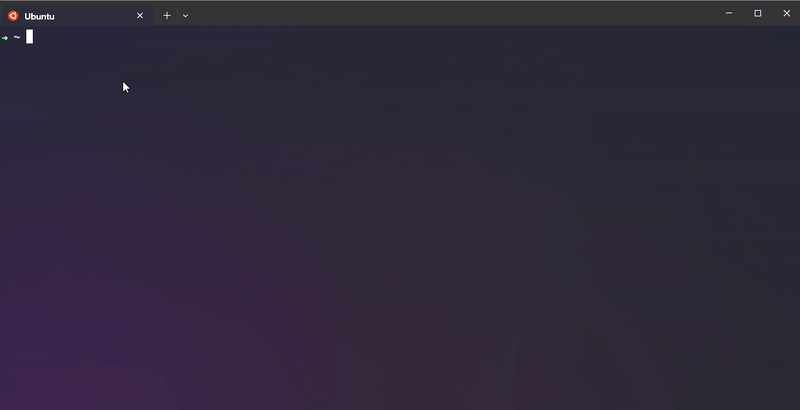

<div align="center">

    ██╗         ███╗   ███╗██╗███╗   ██╗██╗███████╗██╗  ██╗███████╗██╗     ██╗     
    ╚██╗        ████╗ ████║██║████╗  ██║██║██╔════╝██║  ██║██╔════╝██║     ██║     
     ╚██╗       ██╔████╔██║██║██╔██╗ ██║██║███████╗███████║█████╗  ██║     ██║     
     ██╔╝       ██║╚██╔╝██║██║██║╚██╗██║██║╚════██║██╔══██║██╔══╝  ██║     ██║     
    ██╔╝███████╗██║ ╚═╝ ██║██║██║ ╚████║██║███████║██║  ██║███████╗███████╗███████╗
    ╚═╝ ╚══════╝╚═╝     ╚═╝╚═╝╚═╝  ╚═══╝╚═╝╚══════╝╚═╝  ╚═╝╚══════╝╚══════╝╚══════╝
---
Coded with 💗 by: [mflores-](https://github.com/mariav7) and [pmaimait](https://github.com/paridaMamat)

</div>

## Project

[**Subject PDF**](misc/en.subject.pdf)

The purpose of Minishell is to create a simple small [shell](https://en.wikipedia.org/wiki/Shell_(computing)) program based on [Bash](https://www.gnu.org/software/bash/manual/html_node/What-is-Bash_003f.html#:~:text=The%20name%20is%20an%20acronym,Labs%20Research%20version%20of%20Unix.).

A shell, in simple terms, is a command-line interface that allows you to interact with your computer's operating system by typing commands in order to tell it what to do.

## Supported feautures

The project's requirements:
* Prompt display
* Command history (⬆️ and ⬇️ arrows)
* System executables available from the environment (`ls`, `cat`, `grep`, etc.)
* Local executables (`./minishell`)
* Builtin commands :
  * `echo` (with option `-n`)
  * `cd` (with only a relative or absolute path)
  * `pwd` (no options)
  * `export` (no options)
  * `unset` (no options)
  * `env` (no options or arguments)
  * `exit` (with exit number) 
* Pipes `|` connects two or more commands in a way that allows the output of one command to be used as the input for another
* Redirections:
  * `>` redirects output
  * `>>` redirects output in append mode
  * `<` redirects input
  * `<< DELIMITER` displays a new prompt, reads user input until reaching `DELIMITER`, redirects user input to command input (does not update history)
* Environment variables (i.e. `$USER` or `$HOME`) that expand to their values.
  * `$?` expands to the exit status of the most recently executed foreground pipeline.
* User keyboard signals:
  * `ctrl-c` displays a new prompt line.
  * `ctrl-d` exits minishell
  * `ctrl-\` does nothing

This Minishell DOES NOT support `\`, `;`, `&&`, `||`, or wildcards.

---

## Installation

**Clone repo and compile project:**
```bash
git clone git@github.com:mariav7/minishell_42project.git
cd minishell_42project && make
```

**To run the program in normal mode:**
```bash
./minishell
```

OR

**To run the program using valgrind:**
```bash
./leak_test.sh
```
---

## Demo
<div align="center">



</div>
